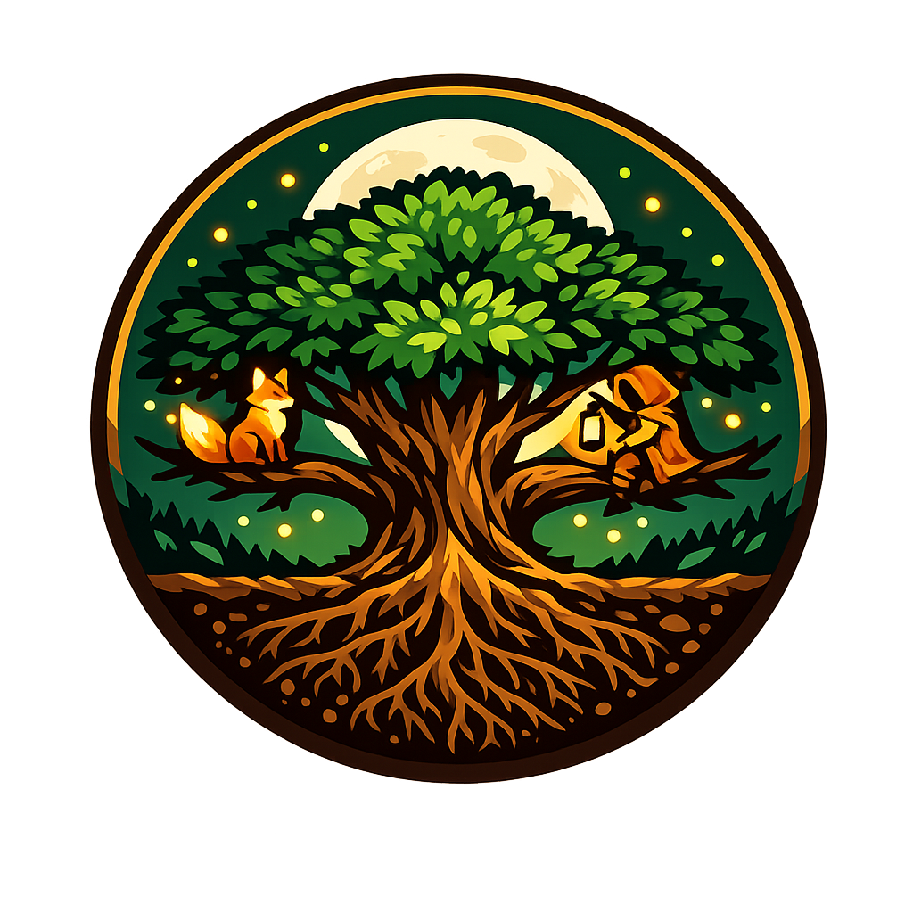

<p align="center">
  
</p>

<h1 align="center">Wilderfolk</h1>

<p align="center">
  <strong>Where Beasts and Kin Unite</strong><br>
  <em>Don’t kill all the wolves.</em>
</p>

<p align="center">
  <strong>v0.5.0</strong> · Early Alpha<br>
  A cozy frontier colony sim — inside the food chain, not on top of it
</p>

---

# 🌿 v0.5.0 — The valley scales

**The valley scales — kin, beasts, and forge-steel.**

This is the **scale + trust** milestone: big towns stay playable, the sim is honest about days and raids, and the forge arms your people for a real frontier.

| | What v0.5 stands for |
|:--:|--|
| **Scale** | Spatial grids, worker sim (opt-in), alive-only entities, leaner tick paths |
| **Trust** | Honest days & raids — moon Howlers, housing, immigration, hunt cadence |
| **Steel** | Blacksmith tier 5 — iron **swords**, **scale mail**, tower **ballistae** |
| **Life** | Hotel, valley stages, elections, painted map, 72 ticks/day |

**Continue your 0.4 colony** — saves step up cleanly into 0.5.

<details>
<summary><strong>Ship highlights</strong></summary>

- Moon Howlers that keep their place in the village after the night  
- Raids you prepare for — counter-marches, real costs, living frontier  
- Families that move and stay together; orphans find a home  
- Forge progression: multi-smith pace, Armament checklist, swords & scale  
- Full notes → [CHANGELOG.md](CHANGELOG.md) `[0.5.0]`  

</details>

---

## Why you’ll want to play

Most colony games ask you to **conquer** the wild.

**Wilderfolk** asks you to **move into it** — and live with the consequences.

Your people fall in love, argue at work, sneak out at night, and trade lines in speech bubbles.  
Deer eat the grass. Wolves eat the deer. Your hunters want the same trails.  
Caravans camp at the edge of the map. Rivals claim the next ridge. Winter burns your woodpile.

Wipe the wolves? You’ll feel clever for a season.  
Then the deer explode, the meadows die, and the hunting packs come home empty.

**You didn’t lose to a raid. You lost to ecology.**

```
  🌿 grass  →  🐰 🦌 prey  →  🐺 🦊 predators  →  🏹 you  →  🏘️ village
```

That loop is the heart of the game. Farms, walls, taverns, elections, and trade are how you stay **human** inside it.

---

## The fantasy

You’re the founder of a **frontier village**. Two pioneers. Empty land. Night coming.

You place a house before dark. A farm at dawn. People walk to work, home, the tavern.  
Children grow up. Couples marry. Affairs leave scars. Orphans get adopted.  
Visitors sleep at your **Hotel**, drink at the **Tavern**, and gossip in the square.  
Full moons turn cursed kin into **Moon Howlers**. Rivals draw red raid lines across the map.  
The Nature tab tells you when the **valley** is strained — before it collapses.  
A **village head** wears the crown. Every five years, merit decides who keeps it.

It’s a **colony sim** with a **food chain**, **families**, and **drama** — not a spreadsheet with trees.

---

## You’ll actually do this

1. **Shelter before night** — house first, or the cold will teach you.
2. **Staff the valley** — farms, mills, smiths; people walk there and back.
3. **Watch them live** — chat bubbles, courtship, scandals, kids, remarriage.
4. **Mind the wild** — Nature tab: Stable → Strained → Damaged → Collapse. Listen early.
5. **Meet the frontier** — visitors, rivals, trade (build a **Market** for long routes), raids you *prepare* for.
6. **Chase a legacy** — Eco-Utopia, Great City, Trade Empire, or Harmony — or just the chronicle.

### First hour

House → farm → watch a workday → open Nature → stock wood for winter → talk to a visitor camp → **leave some wolves alive**.

### Controls

| | |
|--|--|
| Click | Select people, buildings, camps |
| Drag / scroll | Pan / zoom |
| **B** | Build · **1–9** quick buildings · **R** rotate strips |
| **Space** | Pause · speed buttons in the header |
| **V F N P L M** | Village · Frontier · Nature · Progress · Log · More |
| **Esc** | Cancel / clear |

---

## What’s in the game (quick map)

| You care about… | Look here |
|-----------------|-----------|
| Food, work, homes | Farms, houses, jobs, meals, weekends off |
| Money & trade | Store, **Market**, caravans, reputation |
| Drama | Families, affairs, prison, tavern nights, hotel guests |
| Ecology | Wildlife, hunting, **valley stages**, pollution |
| Danger | Raids, walls, barracks, spears, Moon Howlers |
| Goals | Challenges, four victory paths, Focus hints, alerts |
| Leadership | Town Hall, **👑 village head**, elections |

The painted map isn’t just green blocks anymore — meadows, shores, forests, and clutter make the valley feel like a place you live in.

---

<details>
<summary><strong>Full systems list</strong> (open if you want the complete menu)</summary>

### Build

| Category | Buildings |
|----------|-----------|
| **Homes** | House, Mansion |
| **Food** | Farm, Greenhouse, Barn, Silo, Mill, Hunting Spot |
| **Industry** | Lumber Mill, Quarry, Mine, Blacksmith, Workshop |
| **Trade** | Store, Market |
| **Civic** | Town Hall, School, Hospital, Church, Well, Prison |
| **Life** | Tavern (evening Innkeeper), Hotel (2 staff, 4 guest beds), Taming Post |
| **Defense** | Wall / Corner / Gate, Watchtower, Barracks, Road |

Strip-place walls and roads; construction fills day by day.

### Economy

Wood · stone · food · gold · storage · spoilage · workshop recipes · blacksmith forge queue · trade routes (reputation **and** Market).

### People

Weekday work · night home · evening out · weekends free · courtship · marriage · divorce · remarriage · school · hospital care · Town Hall petitions · jobs from farmer to hotelier.

### Land & seasons

Map size and land type · spring → winter · weather · ecosystem health · **valley stage** (Stable → Collapse) with Focus tips when you should ease up.

### Wildlife

Grass, rabbits, deer, foxes, wolves, wildkin · hunt lines on the map · don’t erase the top of the chain.

### Visitors & rivals

Seven visitor kinds (traders, pilgrims, scholars, hunters, nomads, refugees, performers) · Hotel lodgings · diplomacy · raids / counter-raids · combat log.

### Spectacle

Moon Howlers · taming · Renffr omen · night glow, hunt chases, build confetti (toggle in ☰).

### Victory

Eco-Utopia · Great City · Trade Empire · Harmony · challenges under Progress → Goals · chronicle in the Log.

</details>

---

## Good first checklist

- [ ] House before night one  
- [ ] Farm staffed, food stable  
- [ ] Valley still “alive” on Nature (Stable or Strained is fine)  
- [ ] Hosted — or deliberately refused — a visitor group  
- [ ] First winter with wood and food  
- [ ] A few wolves still roaming  
- [ ] Found the village head 👑 (map crown or header chip)  
- [ ] Peeked at Progress → Goals  

---

## Play (alpha)

*Browser build for now — Steam / installer later.*

**Need:** [Node.js 20+](https://nodejs.org) · a modern browser  

```bash
# from the repo root
npm install
npm start
```

Open the URL the terminal prints (usually **http://localhost:5173**). Stop with `Ctrl+C`.

| Stuck? | Try |
|--------|-----|
| `npm` missing | Install Node, restart the terminal |
| Blank / old graphics | Hard refresh `Ctrl+Shift+R` |
| Port busy | Close other dev servers |
| Install fails | Delete `node_modules`, run `npm install` again |

Early alpha: balance moves, saves migrate, edges are rough. Your “that felt unfair” notes are how the frontier improves.

**Don’t kill all the wolves.**  
Tutorial, thesis, and warning label in one line.

---

## For builders (dev)

| | |
|--|--|
| Changelog | [CHANGELOG.md](CHANGELOG.md) |
| Roadmap | [ROADMAP.md](ROADMAP.md) · [docs/archive/ROADMAP_0.5.0.md](docs/archive/ROADMAP_0.5.0.md) (0.5 archive) |
| Marketing | [docs/MARKETING_v0.5.0.md](docs/MARKETING_v0.5.0.md) |
| Dev server | `npm start` / `npm run dev` |
| Lint | `npm run lint` |
| Tests | `npm test` |
| Dead code / deps | `npm run audit:knip` |
| Import cycles | `npm run audit:deps` · both: `npm run audit` |
| Dupes | `npm run dup` |

Sim code lives under `src/`. Private notes stay in `private/` (gitignored).

---

<p align="center">
  <strong>Wilderfolk</strong> · Where Beasts and Kin Unite<br>
  <em>Build the village. Guard the balance. Tell the story.</em>
</p>
