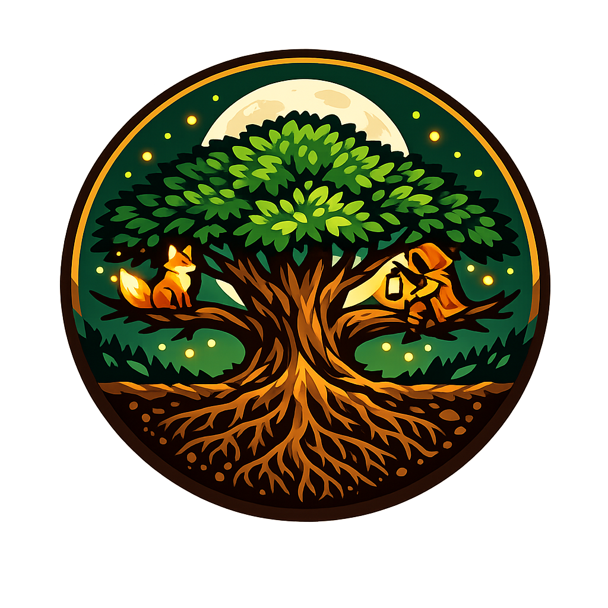

## Wilderfolk

<p align="center">
  
</p>

<p align="center">
  <strong>Where Beasts and Kin Unite</strong><br>
  <em>Don't kill all the wolves.</em><br>
  <em>A cozy frontier settlement sim — built inside the food chain, not on top of it.</em>
</p>

## What is Wilderfolk?

Most settlement games ask you to **tame** the wild. Wilderfolk asks you to **move into it** — and not wreck the neighborhood on your way in.

You are not conquering a blank map. You are sharing a valley with grass, rabbits, deer, wolves, rival camps, caravans, winter, and the occasional curse under a full moon. Every choice ripples through the chain: wipe out the wolves and your hunters go hungry two seasons later. Pave too fast and the ecosystem buckles. Arm your militia, sign a peace treaty, or pay tribute — but **raids test preparation**, not a fancy battle screen.


```
**🌿 → 🐰 > 🦌 →  🐺 > 🦊  →  🏹  →  🏘️**
```


**Build homes. Assign workers. Watch families grow.** Every settler carries three personality traits from a pool of fourteen — 💪 Hardy, 🛡️ Brave, 🗣️ Gregarious, 🐇 Timid, 🌿 Greenthumb, 🍀 Lucky, 💗 Nurturing, 🔮 Insightful, 🦁 Chivalrous, 🔨 Resourceful, 🏔️ Stoic, ✨ Graceful, 🦉 Intuitive, 🔥 Fierce — inherited from their parents, DNA-style, so the brave father's daughter carries his fire. Meet neighbor tribes on the map, queue iron at the Blacksmith, survive Moon Howlers, and shape your own legacy. The valley feels alive because the sim treats predators, prey, and people as one system.


*THIS WILL BE LAST UPDATE FOR THE NEXT PERIOD, BECAUSE OF THE SCALE OF THE PROJECT WE GONNA PORT THE GAME TO A REAL GAME ENGINE. *
*WE DONT KNOW WHICH ONE IT WILL BE BUT WE KEEP  YOU INFORMED IF WE HAVE MORE INFORMATION.*
--

---

## v0.6.5.0 (September 29, 2026)

* `GAME_VERSION` **0.6.5.0**
* ⚠️ **Beta Save Policy:** This build loads only **0.6.5.0** saves.

**A more rugged, atmospheric, and ever-changing landscape.**

Welcome to the ultimate frontier upgrade! In this landmark version, we are incredibly excited to introduce **Teraforge**—our brand-new, completely custom terrain engine that unleashes a total tactical and atmospheric revolution across the valley! We have officially melted down the old rigid, flat grid blocks right to the bedrock. In their place rises a magnificent, deeply layered 2.5D ecosystem where the raw shape of the earth dynamically commands the flow of the food chain, dictates shifting weather behaviors, and fundamentally changes how you strategize, build, and defend your settlement! Get ready, because the wilderness just truly came alive!

`A precompiled version is ready for download under releases`
---

## 🏔️ Real Relief & Mountain Ranges
--

The valley's vertical range grows dramatically, and the mountains that ring your home finally feel like mountains.

* **Clustered ranges, not lonely mounds.** Peaks form connected chains that wall off regions — sun-lit ridgelines, shaded cliff faces, and snow-capped crests rising out of the plain.
* **Elevation changes everything.** As the land climbs, so does life on it:

 
* **Valley floor**  Temperate meadows, deciduous groves, blueberry stands, warm ground your settlers know best. 
* **Mid-slopes**  Pine and boreal cover, cooler air, steeper commutes that tax stamina. 
* **High crests** Wind-scoured rock and glacial snow — beautiful to look at, brutal to build on. 

* **Natural high ground.** Enclosed upland valleys, sheltered plateaus, and cliff-backed pockets make genuinely defensible ground for a frontier village facing raids.
* **Topographic Rain Shadows.** Mountain ranges now block incoming weather. Rain-heavy winds from the west-south-west create lush, wooded slopes on the windward side, while leaving dry, open plains in the shadow behind the peaks.
* **Latitude-Based Climate Zones.** The map now tracks actual latitude. The center row acts as a warm equator, while the top and bottom edges gradually cool into true polar and boreal zones, creating natural regional frontiers.

---

# 🕳️ Living Watersheds & Carved Land

Water no longer trickles across the map as a thin blue thread — **it shapes the terrain it flows through**.

* **Gradient-walker rivers.** Water follows downhill elevation with organic meander noise and inertia.
* **Whole-tile rivers that carve.** Systems cut deep gorges and ravines through high ground before spilling toward the lowlands, leaving dramatic drops and smooth, hand-painted shores.
* **Smooth distance fields.** River edges blend seamlessly into the surrounding terrain with absolutely no blocky cells.
* **Width growth.** Thin mountain streams dynamically widen into broad, deep lowland rivers as they accumulate drainage.
* **Waterfalls.** Automatically generated wherever rivers meet steep elevation drops, complete with animated white spray particles.
* **Lakes, basins & floodplains.** Water pools naturally where the land dips, feeding fertile riverbanks: prime farming, fishing, and settlement ground if you read the terrain right.
* **River ≠ ocean.** Distinct, readable color profiles: rivers run a clear teal-blue, while the open ocean sits in a dark navy.
* **Terrain that tells a story.** Every generated valley presents its own unique natural bottlenecks, corridors, and vantage points to adapt your layout to.

---

# 🌿 Seamless Biomes & Soft Borders


Biomes no longer snap together at hard square edges. The engine blends **temperature, moisture, and elevation** into organic, fluid gradients — no tile seams, no grid squares, no guillotine edges.

```text
Cold/Dry (Tundra) ◄──────► Cold/Wet (Taiga)
       ▲                          ▲
       │     [Organic Gradient]   │
       ▼                          ▼
Warm/Dry (Steppe) ◄──────► Warm/Wet (Meadow/Wetland)
```

* **15 biomes flowing into one another.** Watch the map shift smoothly: deep water → rivers → sand → desert → dirt → grass → meadow → forest → dense forest → taiga → swamp → tundra → rock → snow.
* **Biomes ride the terrain.** Vegetation regions conform to the land instead of dictating it — a forest can spread across flat bottoms, climb a hillside, or crown a coastal bluff.
* **Per-pixel rendering.** Enjoy smooth Whittaker-style color gradients alongside biome-specific textures — including grass streaks, dirt grain, sand ripples, rock cracks, and snow sparkle — fully visible when you zoom in.
* **Elevation shading.** Advanced hillshading, cast shadow passes, slope edges, and progressive altitude dimming bring deep physical form to your display.
* **The food chain flows across the blends.** Grass, prey, predators, and people all share a topographic layout that finally makes ecological sense.

---

# 🌊 Coastlines & Frontier Edges


* **Coasts with character.** Oceans and riverlands gain real shelving, sheltered coves, and rugged, cliff-lined edges instead of one uniform shore.
* **Terrain-aware placement.** Starting areas, resources, and paths respect the shape of the land. Warm, hand-made footpaths thread through the relief instead of clipping straight through it.

---

# 🌦️ Weather with a Pulse

We have fully integrated Teraforge's dynamic weather registry, moving away from simple frame-by-frame shifts to a fully smooth, frame-rate independent atmosphere.

* **☁️ Drifting Cloud Layers & Parallax Fog:** Volumetric, soft clouds drift across the sky, dynamically changing with active storms or droughts. Low-hanging fog rolls through the valleys with beautiful cinematic depth as you move the camera. Fog's veil finally draws exactly the way it was always meant to.
* **☀️ Daylight Temperature Cast:** The world's lighting shifts with the weather. Feel the oppressive heat haze during a summer drought, or the crisp, cold casting during winter snowfalls.
* **🪨 Grit Underfoot:** Zoom right in — the surface detail holds up. Rock fields show real bedding ledges and rubble, snow fields are wind-worked into drifts, dirt shows fine gravel, and grass has visible tussocks and soil showing through.
* **⏱️ Frame-Rate Independence:** Environmental particle systems move at the same speed on every screen—no more double-speed rain or storm visuals on 120 Hz or 144 Hz displays.

---

# 🏘️ A Settlement You Can Read at a Glance

* **👣 Grounded World Depth:** Human, wildlife, tree, and building sprites share unified contact shadows with a gentle cast direction, ensuring the settlement sits firmly in the valley.
* **🏡 Living Upgrades:** Buildings visually reflect their tier updates at a glance. Watch scaffolds grow during construction, and spot warm windows, chimney smoke, glowing forge fires, or late-night tavern activity across the lanes.
* **🎨 Sprite Harmony:** Enjoy a completely consistent frontier aesthetic with one synchronized lighting direction, palette, outline weight, and sense of scale across all people, animals, trees, and buildings.
* **🗺️ Infrastructure Blueprint (Hot Seat):** Use the **X** hotkey overlay anytime to track supply routes, check commute pressure, identify blocked path grids, or manage workforce policy presets instantly.

---

## 🌿 Life & Atmosphere

The valley is alive with environmental detail, all driven by deterministic, seed-safe presentation streams:

| Type | Count | Examples |
|---|---|---|
| **Trees** | 4 variants × 2 types | Oak (round canopy), Pine (tiered triangles), Fruit tree (colored fruits), Palm. |
| **Plants** | 8 types | Bush, flower, fern, tallgrass, berries, reed, cattail, scrub. |
| **Ground objects** | 7 types | Rock (small/big), stump, log, driftwood, bones, dirt patch. |
| **Water props** | 1 type | Lilypad (with optional flowering variants). |
| **Wildlife** | 2 types | Birds (V-shape, flapping), Butterflies (colored wings, fluttering). |

* **Wind animation.** Foliage responds directly to the climate; trees sway organically from the canopy while trunks stay planted, and grass and reeds bend in clusters.
* **Birds & butterflies.** Fully animated over forests and meadows, driven by deterministic flocking positions.
* **Waterfall spray.** Crisp white particles track actively where rivers take sudden drops.

---

# 🧱 Built on a Four-Layer Grid

The new terrain completely replaces the old world generation *and* pathfinding backend, anchoring every simulation step into one clean, optimized structure:

```text
┌──────────────────────────────────────┐
│ L3 DECOR    Free sprites             │ ← 23 decoration types
├──────────────────────────────────────┤
│ L2 TERRAIN  64px biome cells         │ ← 15 biome types
├──────────────────────────────────────┤
│ L1 BUILD    20px placement grid      │ ← Snap grid for structures
├──────────────────────────────────────┤
│ L0 PATH     10px collision grid      │ ← Pathfinding / occupancy
└──────────────────────────────────────┘
```

* **100% Deterministic.** Same seed + same settings = identical world across save, load, and worker hand-offs, forever.
* **3 massive PC map sizes.** Play your way on Medium (2560×1920), Large (4096×3072), or our staggering new **Huge maps (6144×4608)** which provide ~5.8× the buildable area of the previous version.

---

# ⚙️ Under the Hood (For the Frontier Engineers)

While you enjoy the views, the simulation under the hood has been heavily optimized to handle massive PC-scale populations without a single stutter:
* **The Hybrid Data Grid:** Seamlessly blends old tile readers with ultra-fast flat typed-arrays, drastically improving memory cache performance on massive map sizes.
* **The 360-Day Oracle Verified:** We ran the simulation through a full year of active play on the largest map sizes. The engine cleared the test with **0 invariant violations, 0 stalled ticks, and 0 worker fallbacks**. 


---

## v0.6.4.1 (September 21, 2026)

**A deeper, clearer, and more responsive valley.**

* `GAME_VERSION` **0.6.4.1**
* ⚠️ **Beta Save Policy:** This build loads only **0.6.4.1** saves.

| Area | Highlights |
|------|------------|
| 📊 **Village Dashboard** | A new full-screen overview (📊 in the HUD) tracks valley concerns, daily food production, and wildlife trends, giving you a calm space to plan your next move. |
| 📉 **Clearer Daily Reports** | The Daily Council Report now provides a concise summary of your settlement’s net food, housing pressure, and life events, keeping you informed without the clutter. |
| 🔍 **Diagnostic Inspector** | The new inspector completion provides a dependable view for every settler, showing their current activity, commute target, work/home status, and "why" behind their current task. |
| 🎯 **Explainable Choices** | Story and diplomacy decisions now clearly explain why an action is blocked—such as missing resources or requirements—so you always know how to prepare. |
| 🛡️ **Workforce Policies** | New strategic presets (Survival, Growth, Defense, Comfort) help you steer your village’s priorities, while manual overrides remain fully authoritative. |
| 🗺️ **Logistics Overlay** | Use the **X** hotkey to view a new read-only overlay that highlights supply routes, commute pressure, and poorly connected buildings to optimize your layout. |
| 🏅 **Legacy Goals** | The Valley Chronicle now tracks meaningful milestones—like surviving winter, keeping a promise, or recovering from a shortage—to celebrate your village’s history. |
| 🚶 **"What Changed?" View** | The dashboard now highlights day-over-day changes in population, food storage, and wildlife, helping you spot trends in the food chain at a glance. |
| 📈 **Performance & Health** | New integration-tested scenarios and performance metrics ensure the valley runs smoothly on Huge maps, with improved A* pathfinding accuracy and bundle optimizations. |
| 🎭 **Living Characters** | Ten new male & female character variants and "famine desperation" behaviors bring more variety and drama to the community as your settlement ages. |


---

##  Wilderfolk v0.6.4 (27 augustus 2026)

- `GAME_VERSION`: **0.6.4**

- Package version: **0.6.4**

- Save policy: **0.6.4 saves only**; saves from earlier builds are not compatible.

> **v0.6.4 Windows package available** — download the standalone desktop installer from the [GitHub Release](https://github.com/Rengerams/wilderfolk/releases/tag/v0.6.4), or continue playtesting in your browser.

### Choose how to play

- **Windows desktop:** Download `Wilderfolk_0.6.4_x64-setup.exe` from the [GitHub Releases](https://github.com/Rengerams/wilderfolk/releases) page. The Tauri desktop build opens in a maximized window and does not require Chrome, Node.js, Rust, or the repository source.
- **Browser:** Clone or download this repository, install the dependencies with `npm install`, and run `npm run dev`. Open the local URL shown by Vite in your browser.
- **Developer desktop mode:** Run `npm run tauri:dev` for a separate Tauri window with hot reload, or `npm run tauri:dev:log` to also capture a timestamped development log under `logs/`. These commands are for development and are not required by installer users.


**A standalone Windows desktop package is now available.** Download the recommended [`.exe` installer](https://github.com/Rengerams/wilderfolk/releases/download/v0.6.4/Wilderfolk_0.6.4_x64-setup.exe), or use the [`.msi` package](https://github.com/Rengerams/wilderfolk/releases/download/v0.6.4/Wilderfolk_0.6.4_x64_en-US.msi) for managed installation workflows. View the complete [GitHub Release v0.6.4](https://github.com/Rengerams/wilderfolk/releases/tag/v0.6.4) for release notes and both downloads.

- **Recommended Windows installer:** [Download `Wilderfolk_0.6.4_x64-setup.exe`](https://github.com/Rengerams/wilderfolk/releases/download/v0.6.4/Wilderfolk_0.6.4_x64-setup.exe)
- **MSI package:** [Download `Wilderfolk_0.6.4_x64_en-US.msi`](https://github.com/Rengerams/wilderfolk/releases/download/v0.6.4/Wilderfolk_0.6.4_x64_en-US.msi)
- **Release notes:** [View GitHub Release v0.6.4](https://github.com/Rengerams/wilderfolk/releases/tag/v0.6.4)

The browser version remains available for quick playtesting. Developers can use `npm run tauri:dev` for a separate desktop window with hot reload or `npm run tauri:dev:log` for timestamped development logging.

This release is focused on desktop distribution. The terrain overhaul, Settler Inspector, Oracle advice system, connected formations, and weather-layer work remain separate development tracks.

The desktop build runs in a separate maximized Tauri window and does not require Chrome, Node.js, Rust, or the repository source. The browser version remains available for development and quick playtesting.

### Why use the Tauri desktop build?

Tauri gives Wilderfolk a focused Windows application shell around the same game frontend and authoritative simulation. It does not replace the simulation or magically make every system faster, but it removes much of the overhead and distraction of running a demanding game inside a general-purpose browser session.

| Benefit | What it means for Wilderfolk |
|---|---|
| **More focused play session** | Wilderfolk runs in its own maximized window instead of sharing space with browser tabs, extensions, and unrelated pages. |
| **More predictable desktop environment** | The packaged app uses a dedicated application window and avoids browser-session overhead that can make performance diagnosis difficult. |
| **Native Windows distribution** | Players can install a versioned `.exe` or `.msi` package rather than cloning the repository or setting up a development environment. |
| **Better performance headroom** | The desktop shell reduces browser overhead around the game. The simulation, worker, and renderer still need their own optimization, so this is improved operating context—not a promise of unlimited FPS. |
| **Clearer diagnostics for development** | Tauri development mode supports hot reload and a single timestamped log runner, making startup, worker, and rendering issues easier to investigate. |
| **Same game authority** | Packaging does not create a second simulation. The existing worker-authoritative game state and save rules remain the source of truth. |

For ordinary players, the practical result is simple: install Wilderfolk, launch it as a normal Windows application, and play without opening a separate Chrome window. Developers can still use the browser path when they need the fastest web iteration loop.

Wilderfolk is gradually moving toward its **first proper release**, so ease of access matters as much as new features. Tauri is part of that release-readiness work: players should be able to download one package, install the game, and start playing without first understanding Node.js, Rust, Vite, browser tabs, or the project’s development setup. The browser version remains important for development and testing, while the desktop package provides the simpler path for everyday players.

---

| You get | Why it matters |
|---------|----------------|
| **Living food chain** | Grass, prey, predators, and your village share one ecology — balance or collapse |
| **Settlers with personalities** | Three traits each from a pool of fourteen, inherited DNA-style; day jobs, courtship, scandals, families, drama |
| **Frontier diplomacy** | Visitor caravans with real gold purses, rival camps, trade, peace treaties, incoming raids you can *prepare* for |
| **Craft & defense** | Forge tier 5 — iron swords, scale mail, tower ballistae; walls, towers, barracks, guard patrols |
| **Clear goals** | Focus hints, alert strip, sidebar tabs, valley stages — you always know what to do next |
| **Sandbox with goals** | No forced win conditions — optional challenges reward milestones, and a living village portrait writes your story as you play |

**Don't kill all the wolves.** Seriously. That's the whole game in one sentence.

---

## Latest update — v0.6.3 (August 25, 2026)

> **Beta Save Policy:** This build loads only **0.6.3** saves.
>
> **Compatibility note:** Historical-save compatibility is no longer supported. Saves from other builds, including 0.6.2.2 and earlier, are rejected; begin a new settlement for this version.

**A richer frontier, livelier families, and a valley that remembers what you do.**

- `GAME_VERSION`: **0.6.3**
- **Beta build:** v0.6.3 was the current game version for this update.

| Area | Highlights |
|------|------------|
| 📜 **Five stories to discover** | The Deer Parliament, Traveling Theatre, Wedding Diplomacy, Invention Fair, and Rumour Ledger bring memorable multi-stage stories to the valley, with choices that shape your settlement’s history. |
| 🧭 **A guided campaign** | The Valley Remembers connects your important decisions into a gentle, optional campaign with chapters, memories, and milestones. |
| 🗳️ **Elections with consequences** | Village leaders now make promises that can be fulfilled through good planning, giving elections a lasting effect on reputation and community life. |
| 🕰️ **A clearer working day** | Settlers follow a readable 9-hour workday, while the Tavern and Hotel keep their own service hours. Buildings can be managed automatically or assigned by hand. |
| 👨‍👩‍👧 **More family life** | New adult settlers and children add variety to the community, while courtship, marriage, pregnancy, birth, family memories, and amicable changes in relationships make the village feel personal. |
| 🐾 **Care for the animals** | Tamed animals now need regular food and reward good care, making stewardship a meaningful part of living alongside the valley’s wildlife. |
| 🌲 **A living valley that remembers** | Seeded worlds, steadier wildlife, clearer relationship stories, and lasting Chronicle events help the settlement feel consistent from one season to the next. |
| 🛡️ **Stronger frontier choices** | Walls, gates, watchtowers, soldiers, prison guards, rival diplomacy, and raid preparation give the settlement more ways to respond to danger. |
| 🗺️ **Bigger, more beautiful maps** | Medium, Large, and Huge valleys provide more room to grow, with clustered mountain ranges, clearer starting areas, more blueberries, and warmer hand-made footpaths. |
| 🎨 **A more distinctive community** | New adult and child character art, improved buildings, defensive visuals, terrain details, and clearer panels make people and places easier to recognize at a glance. |
| ⚙️ **Player-friendly control** | Automatic staffing remains available as a convenience, while manual building control, clearer work hours, human activity status, and housing feedback help you make decisions with confidence. |

---
## Latest update — v0.6.2.2 (August 21, 2026)

**A village with healthier rhythms, deeper rivalries, and more stories to remember.**

* `GAME_VERSION` **0.6.2.2**
* ⚠️ **Beta Save Policy:** This build loads only **0.6.2.2** saves.
* **Compatibility Dropped:** Historical-save compatibility is no longer supported.
* **New Start Required:** Saves from any other build, including 0.6.2.1, are rejected; please begin a new settlement.

| Area | Highlights |
|------|------------|
| 🕰️ **Workday control** | Set practical work hours for your settlers so the village can follow a clearer daily rhythm. Settlers now respond to work windows with improved rest, recovery, and fatigue feedback. |
| 🍺 **Independent venue hours** | The Tavern and Hotel keep their own opening schedules, so hospitality continues to feel like a living part of the settlement rather than a copy of the general workday. |
| 😴 **Rest and recovery** | Work intensity, fatigue, and recovery now communicate more clearly, helping you balance productivity with the wellbeing of your people. |
| 🛡️ **Rival clans remember** | Rival clans now keep persistent profiles and ledgers, develop their own daily priorities, and respond to the colony’s choices over time. |
| 🤝 **Diplomacy with consequences** | Rival demands, offers, treaties, recovery and preparation form a continuing diplomatic conversation. Choices can improve relations, create pressure, or change the character of the frontier. |
| 🗺️ **A more readable frontier** | Rival camps now have stronger map presence, visible activity cues, relationship stances, latest-contact details, and Chronicle history so the wider valley is easier to understand. |
| 📜 **Rival history in the Chronicle** | Important rival contacts and changing relationships are easier to follow, giving diplomacy a memory instead of making every encounter feel isolated. |
| 🏚️ **Ten children at the gate** | After the settlement has had time to grow, a one-time shelter story can bring ten children seeking help. Your decision creates a meaningful act of kindness with consequences that unfold later in the frontier. |
| 💞 **Deeper relationship diagnostics** | Relationship information now offers clearer insight into household bonds, social connections, and the living stories developing among settlers. |
| 🏠 **Housing diagnostics** | Housing feedback makes residence assignments and household conditions easier to understand when the colony becomes more crowded. |
| 📊 **Optional FPS display** | A persistent FPS toggle in Settings lets you keep an eye on presentation performance while playing, without interrupting the settlement experience. |
| 🧭 **A more dependable simulation** | The worker, command, schedule, diplomacy, and presentation systems now share clearer boundaries and stronger regression coverage, supporting a more trustworthy valley as it grows. |

---

## Latest update — v0.6.2.1 (August 21, 2026)

**A village that listens, remembers, and gives you meaningful choices.**

* `GAME_VERSION` **0.6.2.1**
* ⚠️ **Beta Save Policy:** This build loads only **0.6.2.1** saves.
* **Compatibility Dropped:** Historical-save compatibility is no longer supported.
* **New Start Required:** Saves from any other build, including 0.6.2, are rejected; please begin a new settlement.

| Area | Highlights |
|------|------------|
| 🥣 **Your first Village Request** | A trader caravan can now make a timed **Caravan Provisions Offer**. Accept it to trade **15 gold** for **30 food** and **+2 reputation**, decline with a small reputation cost, or let it expire when the caravan leaves. The card, Chronicle, feedback, command, save, and worker state all describe the same authoritative decision. |
| 🧪 **Stronger village truth** | Births now have direct golden-contract coverage for ordinary children, stillbirth, rare Wildkin, biological lineage, bastard outcomes, and pregnant immigrants. An actual isolated worker thread now proves ready, tick, command, rejection, and export transport end to end. |
| 🌄 **Grounded 2.5D depth** | Humans, wildlife, trees, and buildings now share contact shadows with a gentle south-east cast direction, so the settlement sits in the valley instead of on top of it. Reduced cosmetic effects keep a compact shadow but remove the extra tail and heavier ambient darkening. |
| 🫐 **Rare blueberry trees** | New settlements receive only **1–3** visible blueberry trees, depending on map size. Hungry free-time settlers can walk to a nearby ripe tree for a small food-and-energy boost; portions regrow slowly outside winter, so berries help but never replace farms or hunting. |
| 🛠️ **A village that responds** | Worker assignments, priest selection, demolition, repairs, upgrades, and building modes now reach the authoritative simulation immediately. The leader can hold a normal job, and the Leader’s House builds in **two** work-days instead of leaving the founding household outside for nearly a week. |
| 🎉 **Festivals feel alive** | From **15:00–21:59** on festival days, settlers leave ordinary work, school, patrols, and free hunting to gather at the green, Town Hall, or performer camp. The tavern stays open; ordinary routines return afterward. |
| 💗 **First loves and family life** | From age **12**, nearby teens may become school-influenced sweethearts. Shared school days and childhood friendships help; some relationships fade naturally, while lasting pairs enter adult courtship at **18**. Fertility begins at 12 through a mutual, nearby youth-love pair at a deliberately lower chance; marriage, homes, work, and affairs remain adult-only (**18+**). |
| 💬 **A chattier frontier** | The seven-category dialogue bank adds oddball village banter, and nearby settlers now reliably join conversations instead of turning every exchange into a leader monologue. Speech bubbles have readable game-hour lifetimes, sit above speakers, and stack cleanly. |
| 📜 **A Chronicle that keeps up** | Worker-generated events now arrive newest-first, without duplicate merges, and the Chronicle includes a dedicated **Milestones** filter. |
| 🏹 **Sharper movement and hunts** | Deterministic heap-backed A* improves route finding; commute caches respect each settler’s target tile. Hunting Spots use shared wildlife cleanup, while arrow visuals expire by their actual wall-clock lifetime. |
| 🎨 **Clearer frontier presentation** | Building art supports per-building scale and ground anchors, so the Leader’s House reads properly in previews and in the world. Live right-side charts were removed to keep the menu focused on village decisions. |
| 🚀 **Performance retained** | The worker-safe social grid, adaptive spatial queries, and fixed 72-tick day preserve active social life and reliable player commands without surrendering the performance gains. |

**Performance**

| Humans | avg tick | p95 tick | Gate |

|--------|----------|----------|------|
| 200 | 4.8 ms | 8.1 ms | ✅ ACCEPTABLE |
| 400 | 7.5 ms | 13.3 ms | ✅ ACCEPTABLE |
| 600 | 11.7 ms | 18.6 ms | ✅ ACCEPTABLE |
| 800 | 18.7 ms | 34.0 ms | ✅ ACCEPTABLE |
| 1,000 | 27.3 ms | 56.0 ms | ✅ ACCEPTABLE |
| 1,200 | 38.0 ms | 64.8 ms | ✅ ACCEPTABLE |
| 1,400 | 49.0 ms | 90.9 ms | ✅ ACCEPTABLE |
| 1,600 | 64.3 ms | 121.0 ms | ✅ ACCEPTABLE |
| 1,800 | 79.1 ms | 152.8 ms | ✅ ACCEPTABLE |
| 2,000 | 103.9 ms | 195.0 ms | ✅ ACCEPTABLE |
| 2,200 | 121.8 ms | 231.5 ms | ✅ ACCEPTABLE |
| 2,400 | 135.3 ms | 270.6 ms | ✅ ACCEPTABLE |
| 2,600 | 172.2 ms | 329.3 ms | ✅ ACCEPTABLE |
| 2,800 | 183.8 ms | 362.9 ms | ⚠️ WATCH |

**Capacity ceiling** 
- **2,600 settlers** stay ACCEPTABLE (p95 329 ms) — the engine can now run almost 100% more citizens.


---

## Previous release — v0.6.1.1 (August 20, 2026)

**The valley makes sense: trustworthy workers, structured simulation, and a rarer night threat.**

* `GAME_VERSION` **0.6.1.1**
* ⚠️ **Beta Save Policy:** This historical build loaded only 0.6.1.1 saves.
* **New Start Required:** 0.6.1 and earlier saves were rejected.

| Area | Highlights |
|------|------------|
| **🧭 One source of truth** | The simulation gained explicit owners, invariants, and a fixed cadence: realtime movement, regular systems, assignment reconciliation, and one daily decision layer. This made work, relationships, births, leadership, and Moon Howler rules easier to trust and test. |
| **👷 Workers answer orders** | Manual assignments, priest selection, demolition, repair, upgrades, and building modes stopped waiting behind an endlessly busy worker queue. Commands now apply promptly and reconcile with the worker-authoritative result. |
| **👑 A leader who helps** | The elected leader can hold a normal workplace while remaining leader, and the Leader’s House was brought down to a two-work-day build so the founding household receives housing early. |
| **⛪ Manual civic staffing** | Church capacity remains four, but the player decides who serves; automatic staffing no longer immediately refills a priest the player removed. |
| **💞 Relationship truth** | Relationship diagnostics distinguish conception attempts, successful new pregnancies, active pregnancies, and births. Affairs, gossip, and scandal decisions use their declared daily/social cadence instead of competing realtime rules. |
| **🌕 Moon Howlers as events** | A surviving cursed settler returns on later full moons; a replacement is a rare roll after the Howler is gone instead of a guaranteed monthly monster. |

## Previous release — v0.6.1 (August 17, 2026)

**The valley thinks faster — population-scale social life without losing its character.**

* `GAME_VERSION` **0.6.1**
* ⚠️ **Beta Save Policy:** This historical build loaded only 0.6.1 saves.
* **New Start Required:** 0.6 and older saves were rejected.

| Area | Highlights |
|------|------------|
| **🚀 Social performance** | A dedicated living-human spatial grid, adaptive grid-versus-array searches, staggered ambient scans, and behavior-specific radii made social life much cheaper at population scale. At release, a 1,200-settler full simulation improved from roughly **192 ms to 70 ms per tick** on the recorded benchmark. |
| **🧩 Clearer simulation modules** | The former life-simulation monolith split into focused entity, relationship, human-tick, and scheduled-layer modules; grass and wildlife moved to their appropriate existing cadence layers. |
| **🎨 Focused renderer** | The renderer split into focused grid, marker, particle, night, preview, weather, scent, entity-composite, and overlay modules, keeping the main renderer as an orchestrator. |
| **🌙 Correct night atmosphere** | Duplicate night darkness and building glow were removed so evening scenes no longer double-darken or over-apply glow. |
| **🌿 Cleaner ecosystem overlay** | Off-screen ecosystem connection lines gained vertical as well as horizontal culling, avoiding unnecessary work beyond the visible map. |

---
## v0.6 (August 17, 2026)

**Build, flow, and grow: watch the valley transform.**

* `GAME_VERSION` **0.6**
* ⚠️ **Beta Save Policy:** This build loads only 0.6 saves.
* **Compatibility Dropped:** Historical-save compatibility is no longer supported.
* **New Start Required:** Saves from other builds are rejected, so please start a new settlement.
* **`V0.6 perf Gate:`** **PASSED**

| Area | Highlights |
|------|------------|
| **🔩 Iron** | The Mine gains an **Extract mode (🪨 Stone / 🔩 Iron)** — switch it per mine in the inspector — and every **Blacksmith forge order now costs iron** (Spears → Ballistae). The forge is an iron sink, not a gold sink |
| **🎓 Guide**         | A living step-by-step guide walks you through your first year (house → farm → workers → wood/meat → gold → winter). It auto-advances as you do things, has a **Skip** button, and the new-settlement screen has an **On/Off choice** |
| **🏚️ Storehouse**     | A new Resources building that shelters **+800 wood storage** for winter; food spoilage drops to 2%/day, and gold is capped at 20,000 — the economy audit's fixes, all in |
| **🏔️ 2.5D Isometric** | The valley reads as a landscape, not colored blocks. **Hand-painted shores** (a painted grass-biome tileset, blob-autotiled) line every coast and river, and **hills and peaks physically rise** out of the plain — raised surfaces with sun-lit edges and shaded cliff faces. Buildings, settlers and props **ride the terrain**; nothing floats on slopes |
| **🌊 Rivers**      | New maps carve **whole-tile water bands 3–5 tiles across** (not 1-tile threads), the thin blue "stream" stroke is gone, and **Riverlands & Coastal valleys finally get rivers** at all |
| **🔨 Upgrades**     | Lv2 buildings grow a warm new roof + chimney, Lv3 a stronger roof, a gold rim and a soft glow at night — upgrades read at a glance |
| **⛈️ Storm damage** | When a storm batters buildings, debris flies and a warning floats up from each battered roof — and the colony now **founds at 08:00**, not midnight |

**And more**

### Extra features
- **🎣 Fishing Spot (Phase 6: rivers feed)** — a new Food building that must straddle water (a dock): staffed fishers haul `8 + 4×workers` food per day, thin in winter (55%), rich in fall (115%). Safer than hunting — no wolves fight back. Generated sprite `fishingspot.png`
- **🌳 Wildlife Preserve (Phase 6: ecology tools)** — a new Community building: fenced wild grove that **restores ecosystem health +4** and shows the valley you're giving back. No workers
- **📜 Valley Chronicle (Phase 7: people become history)** — the victory-path replacement: **9 chapter milestones** (The Foundation → The First Harvest → The Great Hunt → The River's Gift → The Iron Age → The Market Opens → Keeper of the Wild → The Alliance → A Century). Each unlocks once, logs to the chronicle, grants a small reward, and appears as a **center-screen title card**. Progress lives in Progress → Goals. No win/lose — the valley just keeps living
- **🌄 Cinematic moments (Phase 8: feel)** — a title card marks your **founding** and every **chronicle chapter** unlock; **construction now builds up** visually — scaffolds grow from 45% to full size as progress rises
- **🤝 Relationships (Phase 7: relationship webs)** — settlers build **friendships** from shared work, shared homes and childhood school bonds (become friends at 60); **feuds** start when a spouse catches a cheater with a paramour, drain energy daily, and slowly heal. Friends lift each other's energy; the chronicle log tells both stories
- **🎓 Apprenticeships (Phase 7: skills pass on)** — a master (skill ≥ 40) at a staffed production building takes on the nearest juvenile; the apprentice learns fast under a good master and **graduates at skill 50** into the trade. Building panels show who is teaching whom
- **👑 Dynasties (Phase 7: family legacy)** — the Goals tab lists **living dynasties** (surnames across generations), and a true **three-generation dynasty unlocks a Valley Chronicle chapter** ("A Dynasty", +200 gold)
- **🗳️ Elections are real ballots (Phase 7: vote-support)** — every adult settler votes; **merit stays the strongest force** (a candidate ahead by >15 points wins every ballot), while **friendships boost and feuds can cancel a vote** — bonds only tip close races. Results log as "X of Y ballots", and the announcement reads "Elected by ballot"
- **🍞 Food keeps longer** — spoilage drops **3% → 2%/day** and the base food cap rises to 800 (silos still cut further); banking food for winter is now viable
- **💰 Gold has a cap** — 20,000 (was uncapped); the late-game snowball stops and the header shows the cap
- **🌾 Farms reward workers** — farm output now scales `12 + 5×workers` (was a flat 22), so a fully-staffed farm out-produces an empty one


### Performance
- **Quality**   pathfinding, painted valley, economy ledger, quests, trade, elections, multi-select, decor, SFX, weather, App split updated

---

### Previous release — v0.5.4.1 (August 15, 2026)

| Area | Highlights |
|------|------------|
| **🗺️ Choose your land** | The new-settlement screen is a **painted gallery** — six valleys (Verdant, Mountainous, Coastal, Arid, Harsh, **Riverlands** marshland) as tiny landscape cards; map size is a slim segmented control |
| **🎭 People & drama** | **Titles sway elections** (+8 merit for Moonslayer/Howlerbane); schools are **yours to staff** (no auto-teachers, up to **10 kids** per school); kids **gossip** their parents' affairs at school and form **childhood bonds** that shape who they court as adults |
| **👥 Multi-select workers** | Shift-click several settlers at once, then assign them all to one building in a single click |
| **🚶 Real walking** | Human sprites support **4-frame walk sheets** — settlers swing their legs instead of bobbing; outfit variants now spread across the village |
| **🎨 Painted valley** | Procedural decor (snow mounds, beach ripples, rock clusters, meadow flowers) + **work ambience** — the village sounds like work: chopping, mining, hammering, and footsteps pitched by the surface underfoot |
| **🦌 The Passing Herds** | Every autumn a herd of deer crosses the valley — they graze, they're huntable, they leave. **The herds remember:** every deer you take this year makes next year's herd smaller; let them pass and they come back fat as ever |
| **🎉 Seasonal festivals** | **20 guaranteed festival days/year** — Spring Revel, Midsummer Feast, Harvest Festival, Frostfall Feast (5 days each, plus the random ones). Production, courtship & immigration boost; the tavern stays open day and night |
| **🌷 Decor & village beauty** | A **Decor** build tab — gardens, statues, lamps, wooden fences (no art needed, all procedural). Decor stamps neighborhood beauty: settlers drift toward pretty spots in free time, and the Population panel shows a **Village mood** readout |
| **Quality** | Every **0.5.x save loads** (version-gate test pins it); worker-command tests back in the gate; the code hub slimmed 1,489 → 1,072 lines |


### Prior release — v0.5.3 August 12, 2026)

The night hunts back: Moon Howler exorcism overhaul — up to 4 priests, active night hunts, red-dot howlers, guard saves, and the **Moonslayer / Howlerbane** titles. Details → [Roadmap_V0_6.5.MD](Roadmap_V0_6.5.MD).

---

### What's next

Soon...

## How to install

*Early alpha — you need **Node.js** for now. A normal installer or **Steam** build is planned.*

### Requirements

- **[Node.js 20+](https://nodejs.org)** (LTS recommended)
- A modern browser (Chrome, Firefox, Edge, Safari)
- ~500 MB free disk space for dependencies

### Quick start

1. **Get the code**
   - **With Git:** `git clone https://github.com/Rengerams/Wilderfolk.git`
   - **Without Git:** on GitHub, click **Code → Download ZIP**, unzip the folder

2. **Open a terminal** in the project root (the folder that contains `package.json`)

3. **Install and run:**

```bash
npm install
npm start
```

4. **Play** — open **http://localhost:5173** in your browser (or the URL shown in the terminal)

5. **Stop** — press `Ctrl+C` in the terminal

### Troubleshooting

| Problem | Try this |
|---------|----------|
| `npm` not found | Install Node.js from [nodejs.org](https://nodejs.org), then **restart the terminal** |
| Port already in use | Close other copies of the game; check the terminal for another port |
| Blank or stale page | Hard-refresh: `Ctrl+Shift+R` (Windows/Linux) or `Cmd+Shift+R` (Mac) |
| Install fails | Delete `node_modules`, then run `npm install` again |

---

## Documentation

| Doc | For |
|-----|-----|
| **[CHANGELOG.md](CHANGELOG.md)** | Detailed change log by version |
| **[Roadmap_V0_6.5.MD](Roadmap_V0_6.5.MD)** | Roadmap and shipped features by version |
| **[AGENTS.md](AGENTS.md)** | Developers — build, test, lint, audit, commit conventions |

### Optional (developers)

```bash
npm run build       # production build (tsc + vite) → dist/
npm run preview     # serve production build locally
npm run lint        # oxlint, type-aware
npm test            # the gate: check:source -> jscpd -> vitest  (npm test -- help)
npm run audit       # dead code (knip) + import cycles (in-repo scanner)
```

---

## Feedback & questions

**Feedback and questions are appreciated!** You're helping shape what ships for real.

- **Email:** [info@autosolid.nl](mailto:info@autosolid.nl)
- **Playtest notes:** export your village chronicle (Log → Chronicle → Download .txt) and mention what confused you or what you'd love next
- **Issues:** [GitHub Issues](https://github.com/Rengerams/Wilderfolk/issues) for bugs and reproducible steps

## License

Source code is [MIT](LICENSE) — Copyright (c) 2026 Renffr. Audio assets have separate CC licenses.

<p align="center">
  <strong>Wilderfolk</strong><br>
  <em>Don't kill all the wolves.</em><br>
  <em>Build inside the food chain — or watch it collapse.</em>
</p>
