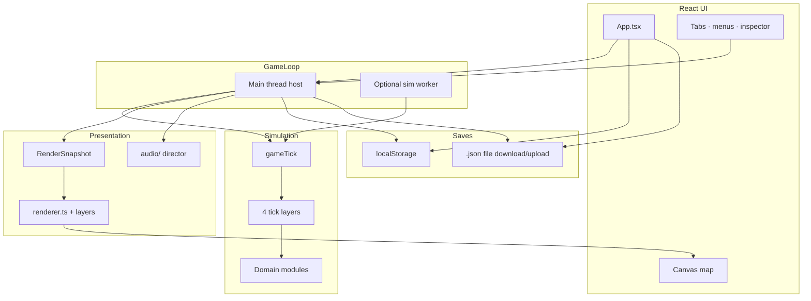
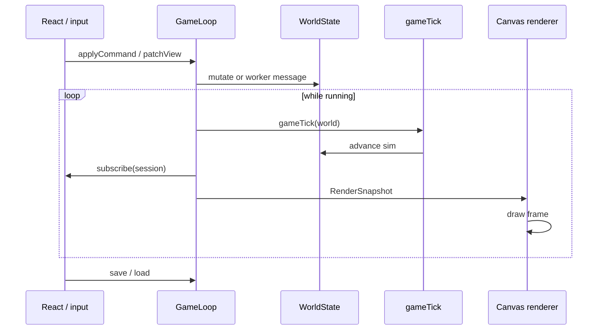
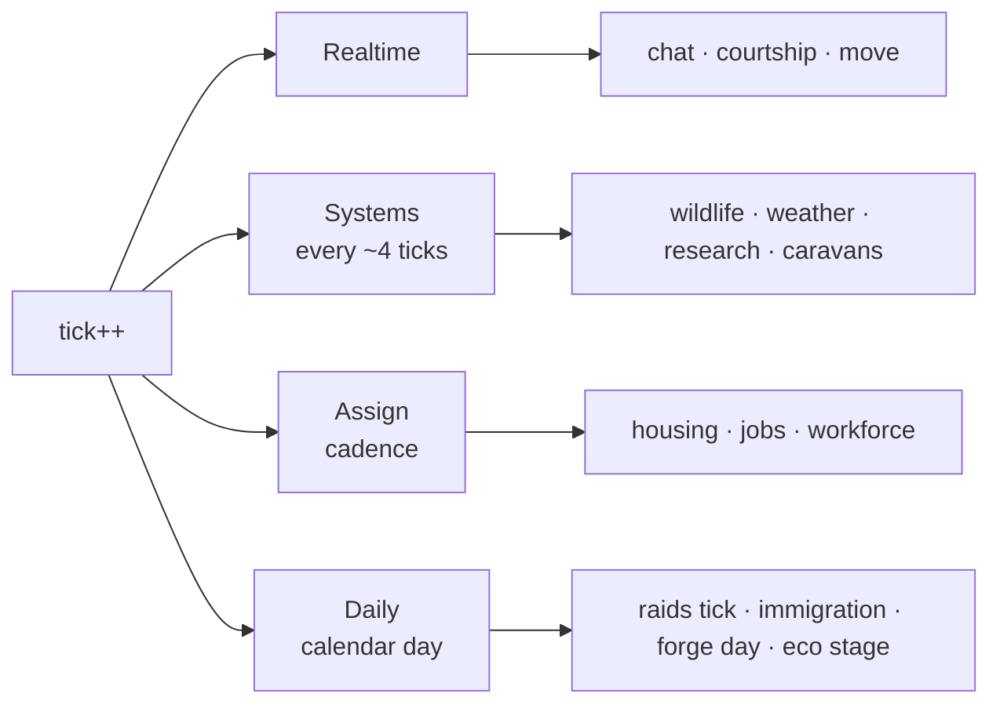
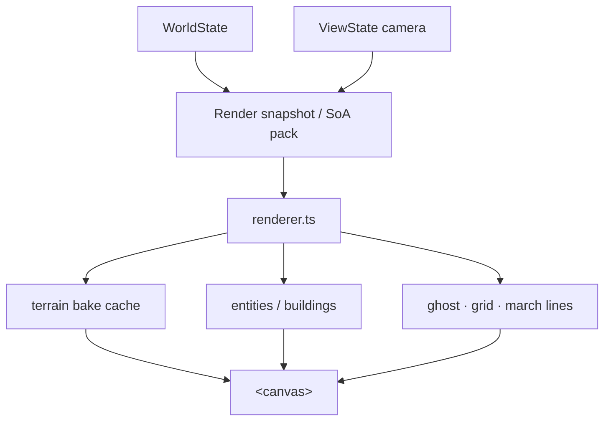
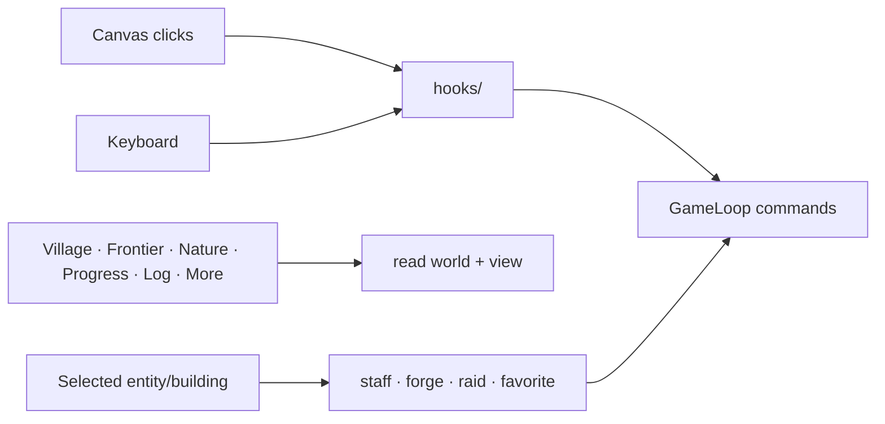
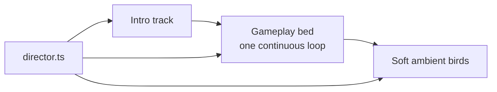
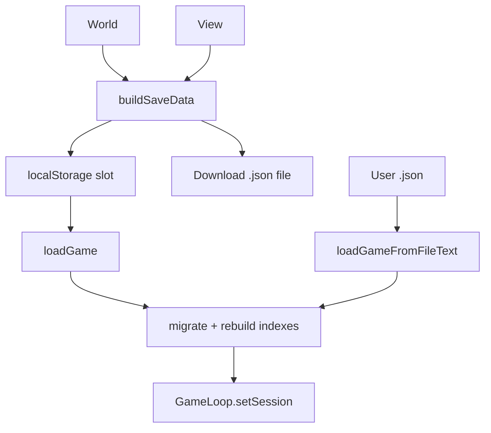
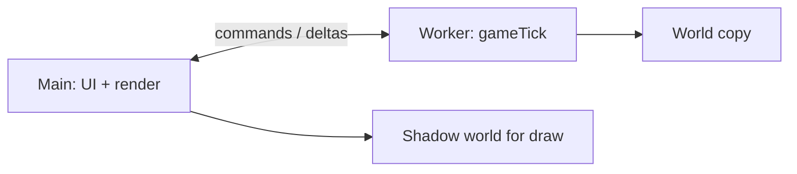

# Wilderfolk — technical architecture

**How the game is wired** (player-facing pitch stays in `README.md`).  
Stack: **React + TypeScript + Vite + Canvas 2D**, client-only, optional **Web Worker** sim.

---

## Big picture



**Idea:** UI never mutates the world ad-hoc during play. It sends **commands** into `GameLoop`; the loop runs **ticks**, then publishes a **snapshot** for React + canvas.

---

## Main loop



| Piece | Role |
|-------|------|
| `App.tsx` | Shell: tabs, banners, build mode, menu, wiring |
| `gameLoop.ts` | Clock, pause/speed, commands, worker optional, notify UI |
| `gameTick.ts` | One sim step: calendar + **four layers** |
| `viewState.ts` | Camera, selection, build ghost, favorite follow (not sim truth) |
| `saveLoad.ts` | Browser slot + **file** `.json` |

---

## Simulation: four tick layers

Work is split so not everything runs every tick (`TICKS_PER_DAY = 72`).



| Layer | File | Typical work |
|-------|------|----------------|
| **Realtime** | `tickLayerRealtime.ts` | Humans move, social, meals, combat chase |
| **Systems** | `tickLayerSystems.ts` | Wildlife AI, weather, research progress, trade walkers |
| **Assign** | `tickLayerAssign.ts` | Fill jobs/homes (not every frame) |
| **Daily** | `tickLayerDaily.ts` | Day boundary: raids expire, visitors, forge day, immigration, wildlife soft refill |

Domain logic lives in modules, not one mega-file:

| Module | Owns |
|--------|------|
| `lifeSimulation.ts` | Human + wildlife tick bodies |
| `dayCycle.ts` | Calendar, housing, age, family helpers |
| `frontierCombat.ts` | Raids (abstract ratios, not a battle screen) |
| `groupEvents.ts` | Visitors, rivals, living camps, diplomacy |
| `moonHowler.ts` | Curse / transform / church |
| `forge.ts` + `combat.ts` | Blacksmith orders → village gear **tiers** |
| `ecologyStage.ts` | Valley stable → strained → … |
| `worldGen.ts` | New map, entities, wildlife spawn/replenish |

**World truth** = `WorldState` in `gameTypes.ts` (entities, buildings, resources, events, …).

---

## Render path



- **Sim** does not draw.
- Terrain can be **baked** and only rebuilt when map/season changes.
- Optional **simBuffers** pack entity data for cheaper draws / worker transfer.

---

## Input & UI



| Area | Notes |
|------|--------|
| **Village** | Pop, families, armament steps, leadership |
| **Frontier** | Visitors, rivals, raid UI |
| **Nature** | Wildlife counts, eco health, season |
| **Progress** | Research, trade, **legend portrait** (not hard win) |
| **More** | Guide (searchable help), roadmap |

---

## Audio



Day/night **does not swap** music beds anymore (that was jarring). Mute/volume via menu.

Tracks live in `public/audio/` and are registered in `src/audio/tracks.ts`.

---

## Saves



- **Browser save** = convenient, can vanish with cache wipe.  
- **Save to file** = real backup you keep.  
- Compatible versions listed in `saveLoad.ts` (`0.4` … `0.5.1`).

---

## Optional worker



If the worker fails to init, **main-thread ticks** still run. Same `gameTick` either way.

---

## Repo map (short)

```
src/
  App.tsx                 UI shell
  components/             React panels
  hooks/                  canvas / keyboard / audio hooks
  audio/                  music + ambient
  game/
    gameLoop.ts           session clock
    gameTick.ts           tick orchestrator
    tickLayer*.ts         four layers
    lifeSimulation.ts     people & beasts
    renderer.ts           Canvas draw
    saveLoad.ts           persist
    frontierCombat.ts     war abstract
    groupEvents.ts        visitors & rivals
    simWorker/            optional off-main sim
    simBuffers/           render packing
```

---

## Mental model (one sentence)

> **React shows a snapshot of a tick-based colony sim; the map is Canvas; saves are JSON; drama (families, raids, moon, neighbors) is systems on a calendar, not a separate multiplayer server.**

---

*Update this file when tick layers, worker, or save paths change in a big way.*
